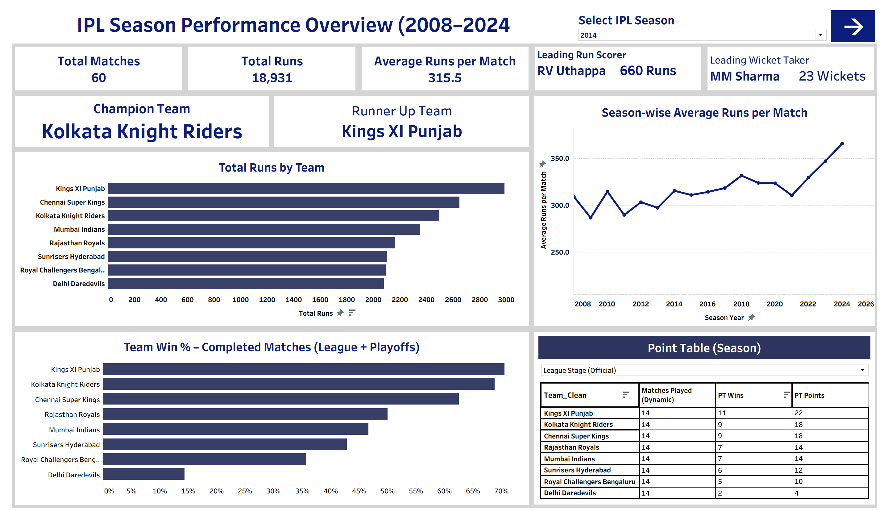
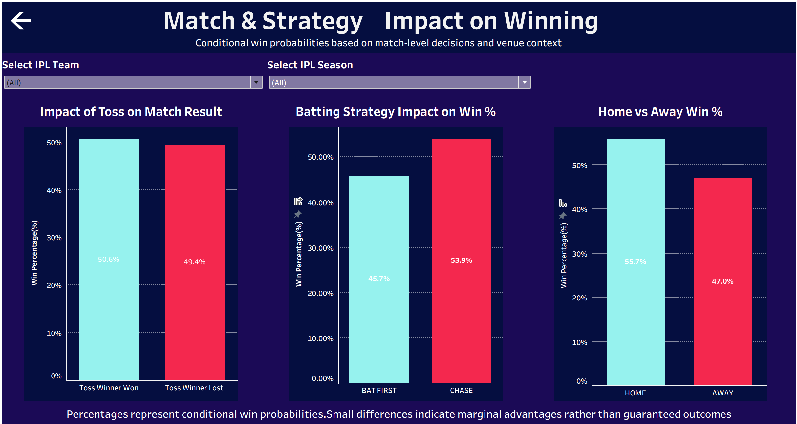

# 🏏 Strategic Performance & Decision Analytics Dashboard

[](https://www.tableau.com/)
[](#-data-engineering--modeling)
[](#dashboard-1--executive-performance-overview)
[](#-dataset)
[](LICENSE)

An interactive, two-page Business Intelligence solution built in **Tableau**. Rather than presenting descriptive sports statistics, this project treats 16 seasons of historical match data as an operational dataset — engineering KPIs, a team-centric data model, and conditional win-probability analysis to test common strategic assumptions against evidence.

**Demonstration dataset:** 16 years of IPL match and ball-by-ball data (2008–2024) — used here because it's a large, messy, real-world relational dataset well suited to demonstrating BI engineering, not because this is a sports-stats project.

---

## 📑 Table of Contents
- [Live Dashboard Preview](#live-dashboard-preview)
- [Business Problem](#business-problem)
- [Dataset](#-dataset)
- [Data Engineering & Modeling](#-data-engineering--modeling)
- [Dashboard 1 — Executive Performance Overview](#dashboard-1--executive-performance-overview)
- [Dashboard 2 — Match & Strategy: Impact on Winning](#dashboard-2--match--strategy-impact-on-winning)
- [Key Insights](#key-insights)
- [Technologies & Methods](#technologies--methods)
- [Repository Structure](#-repository-structure)
- [License](#-license)
- [Author](#-author)

---

## Live Dashboard Preview

### 1. Executive Performance Overview


### 2. Match & Strategy — Impact on Winning


---

## Business Problem

Strategic decisions are often driven by assumption rather than evidence — in sports as in business. Common assumptions tested here:
* Winning the toss provides a meaningful advantage.
* Chasing is always the safer strategy.
* Teams perform better at home.
* High output (runs) translates directly into winning.

This project subjects each assumption to evidence-based testing using 16 years of historical data, rather than accepting conventional wisdom.

---

## 🗄️ Dataset

* **Source:** Kaggle — IPL Complete Dataset (2008–2024)
* **Match-level records:** ~1,095 matches
* **Ball-by-ball transaction records:** 260,000+
* **Format:** Two relational CSVs (match-level dimension table + delivery-level fact table), joined on Match ID

Full source and schema notes: [`data/Dataset.md`](data/Dataset.md)

---

## 🏗️ Data Engineering & Modeling

* **Entity resolution:** Standardized franchise rebranding across seasons (e.g., Delhi Daredevils → Delhi Capitals, Royal Challengers Bangalore → Royal Challengers Bengaluru).
* **Season format standardization:** Unified inconsistent historical formats (2007/08, 2009/10, 2020/21, etc.) into a single time-series-ready field.
* **Venue normalization:** Identified and excluded neutral-venue seasons (UAE, South Africa) to prevent distortion in home-advantage calculations.
* **Edge-case handling:** Abandoned and no-result matches excluded from efficiency denominators.
* **Team-centric data model:** The source dataset is match-centric (one row per match, two teams per row), which makes team-level filtering unreliable — a team appearing in either the Team1 or Team2 column gets missed by simple filters. Restructured the model so each match produces two team-perspective records, enabling accurate team-level filtering, strategy analysis, and conditional calculations.

Full ETL and modeling detail: [`documentation/IPL_Strategic_Performance_Report.pdf`](documentation/IPL_Strategic_Performance_Report.pdf)

---

## Dashboard 1 — Executive Performance Overview

* **KPI Cards:** Total Matches, Total Runs, Average Runs per Match, Champion Team, Runner-Up Team, Leading Run Scorer, Leading Wicket Taker — all dynamic to the selected season.
* **Season-wise Average Runs per Match:** Time-series trend showing scoring evolution across 16 seasons.
* **Total Runs by Team / Team Win % (Completed Matches):** Comparative bar charts, placed side by side deliberately — comparing them is the actual insight (see below).
* **Point Table:** Season-filtered Matches Played / Wins / Points.

## Dashboard 2 — Match & Strategy: Impact on Winning

* **Impact of Toss on Match Result:** Win % when the toss winner won vs. lost.
* **Batting Strategy Impact on Win %:** Conditional win probability, Bat First vs. Chase.
* **Home vs. Away Win %:** Conditional win probability by venue familiarity, neutral venues excluded.
* **Team and Season filters** throughout, dynamically updating all conditional calculations.

---

## Key Insights

**Output does not equal efficiency.** Comparing total-runs and win-percentage charts side by side shows some franchises generate high run volumes without converting that into proportionally higher win rates — production volume and operational efficiency are distinct metrics that don't automatically track together.

**Execution outweighs the toss.** Across the full dataset: 50.6% win rate when winning the toss vs. 49.4% when losing it — functionally a coin flip. Whatever advantage exists is negligible next to actual execution.

**Home advantage is real and measurable.** 55.7% (home) vs. 47.0% (away) — a consistent 8.7-point advantage when neutral venues are excluded from the comparison.

**Strategic choice matters, but margins are narrower than assumed.** Bat First vs. Chase shows a real but moderate gap (45.7% vs. 53.9% across the full dataset) — chasing holds an edge, but it's not the decisive factor conventional wisdom suggests.

---

## Technologies & Methods

**Business Intelligence**
Tableau Desktop · Tableau Public · Interactive Dashboard Design

**Data Engineering**
Data Cleaning · Entity Resolution · Relational Data Modeling · Team-Centric Restructuring

**Analytics**
KPI Engineering · Trend Analysis · Comparative Analysis · Conditional Probability Analysis

---

## 📂 Repository Structure
```text
Strategic-Performance-Dashboard/
├── LICENSE
├── assets/                                       # Dashboard screenshots & cover image
├── dashboard/
│   └── Strategic_Performance_Dashboard.twbx      # Packaged Tableau workbook
├── data/
│   └── Dataset.md                                # Data source documentation
├── documentation/
│   └── IPL_Strategic_Performance_Report.pdf      # Full technical & business report
├── presentation/
│   └── IPL_Strategic_Performance_Presentation.pdf
└── README.md
```

---

## 📄 License

This project is licensed under the MIT License — see [LICENSE](LICENSE) for details. The MIT license covers the project files (documentation, reports) authored here; it does **not** cover the underlying dataset, which remains under the original publisher's license on Kaggle.

---

## 👨‍💻 Author

**Murthaja Afham**<br>
*AI Developer • Data Scientist • Machine Learning Engineer*

<p align="center">
  <a href="https://github.com/Murthaja-ai"></a>
  <a href="https://www.linkedin.com/in/murthaja-afham/"></a>
</p>
